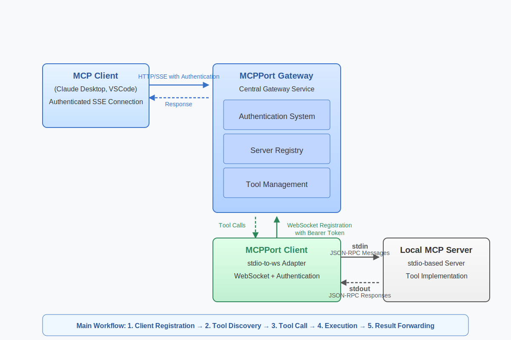
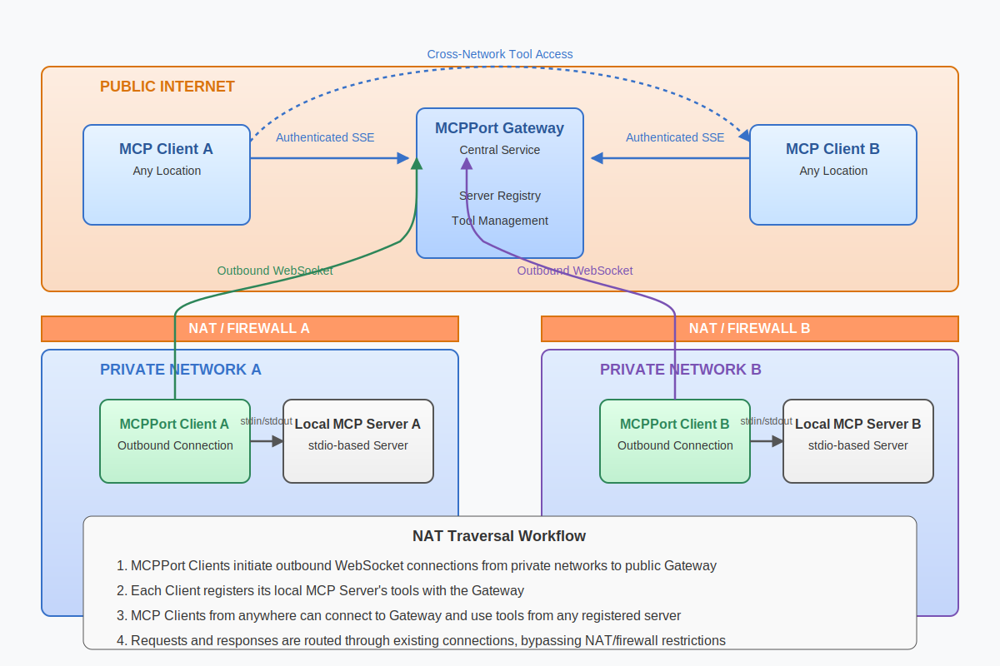

# mcpport

mcpport — A lightweight gateway &amp; registry for Model Context Protocol (MCP), enabling standardized connectivity for AI applications.

## Quick Start

1. Start your MCP Gateway

```bash
uvx mcpport gateway
```

It will start the gateway on port 8765 by default. And the common access points are:

- `ws://localhost:8765/mcp/register` is the registration endpoint.
- `http://localhost:8765/sse` is the event stream endpoint(`SSE`).
- `http://localhost:8765/messages` is the message endpoint(`HTTP`).

2. Register your MCP Server to the Gateway

```bash
uvx mcpport register \
--stdio "npx -y @modelcontextprotocol/server-filesystem ./" \
--gateway-url="ws://localhost:8765/mcp/register" \
--server-name "file"
```

It will register a MCP server named `file` to the gateway. The server is a simple file system server, which is implemented by `@modelcontextprotocol/server-filesystem`.


## Authentication

You can use `--auth-token` to set the auth token for the gateway.

```bash
uvx mcpport gateway --auth-token "my-token1" --auth-token "my-token2"
```

The default authentication method is `Bearer` token(Set to `Authorization` header). 

If you set the auth token for the gateway, you need to set the same auth token for the MCP server when you register it.

```bash
uvx mcpport register \
--stdio "npx -y @modelcontextprotocol/server-filesystem ./" \
--gateway-url="ws://localhost:8765/mcp/register" \
--server-name "file" \
--header "Authorization: Bearer my-token1"
```

And you must set the auth token for SSE connections. You can set the auth token in the `Authorization` header.

## Architecture

The architecture of the MCP gateway is as follows:



**NAT Traversal Architecture for Cross-Network MCP Tool Access**

The MCPPort solution enables edge devices to seamlessly provide MCP services through secure NAT traversal. By establishing persistent bidirectional WebSocket connections between MCPPort Clients (running on edge devices) and the central MCPPort Gateway, the system creates secure tunnels that bypass firewall restrictions.





## Advanced Usage

1. Start Your MCP Gateway With `ipv6` Support

```bash
uvx mcpport gateway --host "::" --ipv6
```

Other options are also available, you can use `uvx mcpport gateway --help` to get more information.

There are some options for the gateway:

- `--host` is the host of the gateway.
- `--port` is the port of the gateway, default is `8765`.
- `--ipv6` is to enable `ipv6` support, default is `false`.
- `--log-level` is the log level of the gateway, default is `INFO`.
- `--timeout-rpc` is the timeout of communication with the MCP server, default is `10s`.
- `--timeout-run-tool` is the timeout to run the tool, default is `120s`.
- `--sse-path` is the path of the event stream endpoint, default is `/sse`.
- `--messages-path` is the path of the message endpoint, default is `/messages`.
- `--auth-token` is the auth token for the gateway, (can be used multiple times).
